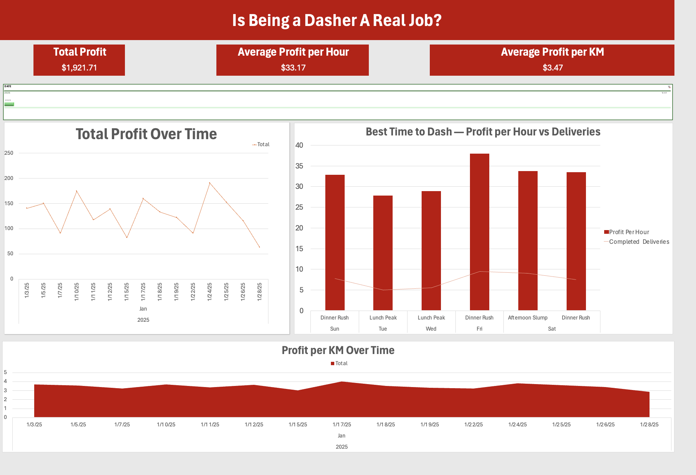

# Dasher Profit Analytics: Excel Data Modeling & Cost Allocation Engine
A complex relational data model and dashboard designed to uncover the true net profit of gig-economy work by automating tax deduction tracking and allocating variable costs.

## Executive Summary
As a university student working part-time for DoorDash, I faced a significant data blind spot: Gross Revenue ≠ Net Profit.

While the DoorDash app tracks earnings, it ignores the operational costs of running a vehicle (fuel, insurance, depreciation, maintenance). This made it impossible to know if a shift was actually profitable or just converting car equity into cash. Additionally, tracking mileage and expenses for end-of-year tax deductions was a manual, error-prone process.

I engineered this Excel solution to transform raw shift data into a P&L (Profit and Loss) statement for every single trip, identifying up to $9,000 in annual tax deductions and optimizing shift scheduling.

## Technical Skills Demonstrated
Advanced Data Modeling: Designed a multi-table relational schema (Star Schema approach) linking Shift Logs, Fuel Logs, and Fixed Expenses.

Cost Accounting Logic: Implemented complex cost allocation methods:

- Variable Costs (Fuel/Maintenance): Allocated based on odometer readings and calculated Cost_Per_KM.

- Fixed Costs (Insurance/Rego): Amortized over shifts using time-weighted averages (Cost_Per_Hour).

- DAX & Power Pivot: utilized Data Analysis Expressions (DAX) to create 12+ dynamic measures for financial performance.

- Formulas: Nested XLOOKUP, SUMIFS, and array formulas to automate data retrieval across 250+ transactions.

- Visual Analytics: Interactive Dashboard allowing for temporal analysis (Profit by Day/Time) and efficiency metrics.

## The Data Architecture
The project moves away from a "flat file" approach and uses a relational structure to ensure data integrity.

### 1. Fact Table: Shift_Log

The central ledger recording every dash.

Inputs: Date, Start/End Time, Odometer Start/End, Gross Earnings.

Calculated Fields: Automatically pulls specific cost metrics from dimension tables to calculate Net_Profit, Profit_Per_Hour, and Profit_Per_KM for that specific timeframe.

### 2. Dimension Tables & Cost Allocation

Fuel_Log (Variable Cost): Tracks every refuel event. The model calculates a running average of Fuel_Cost_Per_KM based on fuel efficiency and gas prices, applying this rate to the business kilometers driven in a shift.

Fixed_Expenses (Fixed Cost): Tracks Insurance, Registration, and Maintenance. These are converted into an hourly operational cost and allocated to shifts based on Total_Time_Dashed.

Time_Intelligence: Helper columns breakdown shifts by Day_of_Week and Time_Period (Lunch/Dinner/Late Night) for optimization analysis.

(Replace this line with a screenshot of your Power Pivot relationship diagram or table structure)

## Key Insights & Analysis
The dashboard answers critical business questions that the standard DoorDash app cannot:

### 1. True Profitability vs. Gross Revenue

By factoring in the calculated $0.xx/km and $x.xx/hour operational costs, the dashboard reveals the real take-home pay.

Example Insight: A shift with high gross earnings might have a lower net profit if it involved excessive highway driving (high fuel cost) compared to a shorter, denser city shift.

### 2. Temporal Optimization (When to Dash?)

Analysis of historical data to determine the highest yield windows.

Best Day: Identifies which days of the week generate the highest Profit_Per_Hour.

Best Time: Compares Lunch vs. Dinner vs. Late Night profitability to maximize return on time invested.

### 3. Tax Readiness & Financial Compliance

Engineered to streamline the end-of-year tax workflow, reducing preparation time by 50% (2x faster) compared to manual logging.

- Maximized Deductions: Systematically captured ~$8,000 in claimable tax deductions annually by accurately tracking every business kilometer and expense.

- Automated Compliance: Instantly generates "audit-ready" totals for the Logbook Method (Business vs. Private usage %) and itemized expenses, eliminating the risk of lost receipts or forgotten shifts.

Note: The data currently populated in this repository is synthetic data generated to demonstrate the functionality and analytical capabilities of the dashboard, protecting personal financial privacy.
